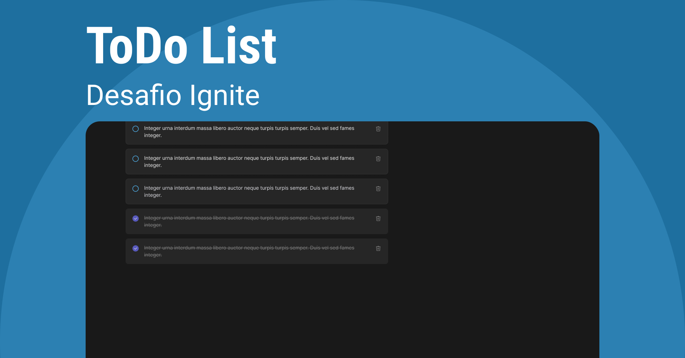

# Desafio 01 - Ignite React 2022 - To-Do List 

Neste desafio foi utilizado os conceitos básicos do React, foi desenvolvido do zero uma simples lista de tarefas com as opções de criar, marcar com lido e apagar um item da lista.

### Foi utilizado

* Vite
* CSS Modules
* Typescript

 